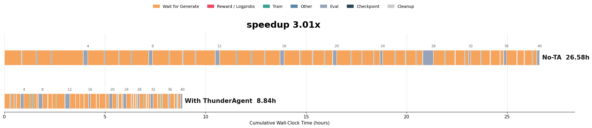

# ThunderAgent + SkyRL: R2EGym 32B Training Recipe

Train Qwen3-32B on R2EGym with ThunderAgent-accelerated rollout scheduling.



**3.01× wall-clock speedup** over the no-TA baseline (8.84 h vs 26.58 h for 40 training steps / 10 epochs).

> **Scope.** This example uses SkyRL + Harbor integration but with MiniSWEAgent
> rather than Terminus 2, and therefore is not token-in-token-out. The same
> ThunderAgent setup should extend to Terminus 2 under Harbor, or to other
> token-level agent harnesses, with minimal changes.

---

## Hardware

| Role | Nodes | GPUs | Notes |
|---|---|---|---|
| Head + rollout | 1 | 8 × H100 | Ray head, ThunderAgent proxy, training driver, 4 vLLM servers at TP=2 |
| Trainer | 4 | 8 × H100 each | FSDP2 policy + ref model |

Total: 5 SLURM nodes, 40 H100 GPUs.

---

## Quick Start

Use the `sbatch` entrypoint for a fresh 5-node run. The lower-level stage
wrapper is still available for debugging or for attaching to an existing
allocation.

### Layout

The top level contains only the Python entrypoints, shared integration code,
configs, docs, and script groups. The R2EGym 32B operational files are
all under `scripts/r2egym_32b/`.

User-facing entrypoints:

| File | Purpose |
|---|---|
| `run_sbatch.sh` | One-command 5-node Slurm entrypoint |
| `run_stages.sh` | Stage wrapper for existing allocations and retries |
| `setup_env.sh` | Creates or validates the vLLM 0.20.1 CUDA 12.9 training venv |
| `prepare_dataset.py` | Creates curated train/eval Harbor task directories |

Internal helpers called by `run_stages.sh`:

| File | Called by | Purpose |
|---|---|---|
| `start_rollout_servers.sh` | `run_stages.sh rollout` | Starts the four vLLM rollout servers on the rollout node |
| `run_trainer.sh` | `run_stages.sh driver` | Runs the SkyRL training driver on the head node after Ray and rollout are ready |
| `prepull_images.py` | `run_stages.sh head` | Lists or pre-pulls Docker images required by the curated tasks |
| `cleanup_docker.sh` | `run_stages.sh cleanup-stage harbor_docker` | Cleans Docker containers and networks for this run |

The Harbor trial defaults live in `configs/harbor_trial/default.yaml`; reusable
SkyRL integration code stays in `skyrl_integration/`.

### 1. Prepare Data

Download the four base difficulty-bucket datasets from HuggingFace:

```bash
for BUCKET in trivial easy medium hard; do
  python examples/train_integrations/harbor/prepare_harbor_dataset.py \
    --dataset NovaSky-AI/r2egym-${BUCKET} \
    --output_dir ~/data/harbor/r2egym-${BUCKET}
done
```

Then generate the curated train/eval task directories used by this recipe:

```bash
python examples/train/thunder_agent/scripts/r2egym_32b/prepare_dataset.py \
  --data-root ~/data/harbor
```

This creates:
- `~/data/harbor/r2egym-train256-medium-hard-v1/` with 256 task symlinks and `MANIFEST.json`
- `~/data/harbor/r2egym-eval64-medium-hard-v1/` with 64 task symlinks and `MANIFEST.json`

### 2. Submit Training

```bash
export REPO_ROOT=/path/to/skyrl-ta-pr-core
cd "$REPO_ROOT"

# Required paths.
export MODEL_PATH=/path/to/Qwen3-32B
export DATA_ROOT=$HOME/data/harbor

# Keep the venv and wheel cache off small root filesystems when possible.
export RECIPE_HOME=${SCRATCH:-$HOME/.cache}/skyrl-thunder-agent

# Optional run controls.
export DOCKER_MODE=rootful
export PREPULL_R2EGYM_IMAGES=true
export ROLLOUT_ENFORCE_EAGER=true

sbatch \
  --partition=<partition> \
  --account=<account> \
  examples/train/thunder_agent/scripts/r2egym_32b/run_sbatch.sh
```

The `sbatch` script requests 5 GPU nodes by default. In the default merged
layout, node 0 runs Ray head, Docker setup, the training driver, and the 4
rollout vLLM servers; nodes 1-4 are trainer workers. It then runs:

```text
setup_env -> cleanup -> prepare -> head -> ray -> rollout -> status -> driver
```

The wrapper defaults match the benchmark variant:

- `TRAIN_DATA=['$DATA_ROOT/r2egym-train256-medium-hard-v1']`
- `EVAL_DATA=['$DATA_ROOT/r2egym-eval64-medium-hard-v1']`
- `MAX_TRAIN_TASKS=256`, `MAX_EVAL_TASKS=64`
- `FULL_EPOCHS=10`, `EVAL_INTERVAL_STEPS=4`, `CKPT_INTERVAL=4`
- `USE_KL_LOSS=false`, `KL_LOSS_COEF=0.0`
- `RUN_PREFLIGHT_CHECKS=false`, `AGENT_RUNTIME_PREFLIGHT=false`

The rollout launcher uses PR-core's native vLLM server module with
`skyrl.backends.skyrl_train.inference_servers.vllm_worker.WorkerWrap` directly.

For CUDA 12.9 drivers, `scripts/r2egym_32b/setup_env.sh` installs the official
vLLM release asset `vllm-0.20.1+cu129`; installing plain `vllm==0.20.1` from
PyPI can select the CUDA 13 wheel.

`scripts/r2egym_32b/setup_env.sh` uses `uv` and installs an editable copy of
the local repo into the training venv. Set `SETUP_ENV=check` when reusing an
existing environment, or `SETUP_ENV=skip` when `PYTHON_BIN` and `RAY_BIN` are
already exported.

`head` uses system Docker by default. If Docker Hub
rate-limits anonymous pulls, run `docker login` on the head/rollout node before
`head`, or keep `PREPULL_R2EGYM_IMAGES=true` so the wrapper fails early while
pre-pulling the 320 curated train/eval task images instead of silently masking
many Harbor trials during training. To inspect the exact image set:

```bash
python examples/train/thunder_agent/scripts/r2egym_32b/prepull_images.py \
  --train-data "$TRAIN_DATA" \
  --eval-data "$EVAL_DATA" \
  --mode list
```

For a temporary escape hatch while debugging non-Docker code paths, set
`PREPULL_R2EGYM_IMAGES=false`; do not use that for a production recipe run.

### Existing Allocation

If you already have nodes allocated, use the stage wrapper directly. This is
mainly useful for debugging failed stages without waiting for a new allocation.

```bash
export WRAPPER="$REPO_ROOT/examples/train/thunder_agent/scripts/r2egym_32b/run_stages.sh"

export MERGED_JOB_ID=<slurm_job_id>
export MERGED_NODE=<head_and_rollout_node>
export TRAINER_NODE_SPECS="<trainer_node_1>:<job_id>,<trainer_node_2>:<job_id>,<trainer_node_3>:<job_id>,<trainer_node_4>:<job_id>"

bash "$WRAPPER" prepare
bash "$WRAPPER" head
bash "$WRAPPER" ray
bash "$WRAPPER" rollout
bash "$WRAPPER" status
bash "$WRAPPER" driver
```

For a single Slurm allocation, use the same `<job_id>` for all entries. The
`sbatch` script constructs this format automatically.

### Validation

Before a full allocation, run the CPU-only checks:

```bash
bash examples/train/thunder_agent/scripts/r2egym_32b/setup_env.sh check
bash -n examples/train/thunder_agent/scripts/r2egym_32b/*.sh
"$PYTHON_BIN" -m py_compile \
  examples/train/thunder_agent/main_harbor_thunder_agent.py \
  examples/train/thunder_agent/skyrl_integration/runtime_setup.py \
  examples/train/thunder_agent/scripts/r2egym_32b/prepull_images.py \
  examples/train/thunder_agent/scripts/r2egym_32b/prepare_dataset.py
```

---

## Key Parameters

| Parameter | Default | Description |
|---|---|---|
| `MAX_TRAIN_TASKS` | 256 | Tasks per epoch |
| `MAX_EVAL_TASKS` | 64 | Eval tasks |
| `FULL_EPOCHS` | 10 | Training epochs |
| `EVAL_INTERVAL_STEPS` | 4 | Steps between evals |
| `HARBOR_AGENT_MAX_TURNS` | 25 | Max agent turns per trial |
| `AGENT_TIMEOUT_SEC` | 9000 | Hard timeout per Harbor trial |
| `MINI_SWE_MODEL_TIMEOUT_SEC` | 1200 | Per-LLM-call timeout |
| `ROLLOUT_ENGINES` | 4 | Number of vLLM rollout servers |
| `ROLLOUT_TP_SIZE` | 2 | Tensor-parallel size per server |
| `THUNDER_AGENT_MODE` | `tr` | TA scheduler mode (`tr` = token-rate) |
| `PREPULL_R2EGYM_IMAGES` | `true` | Pull all train/eval Harbor images during `head` |

All training hyperparameters can still be overridden through environment
variables before invoking `run_sbatch.sh` or `run_stages.sh`.

For debugging only, `run_trainer.sh` can be called directly after Ray and the
rollout servers are already up. Normal runs should go through `run_stages.sh`
so node placement, rollout startup, readiness checks, and cleanup stay in one
place:

```bash
bash examples/train/thunder_agent/scripts/r2egym_32b/run_trainer.sh full \
  trainer.policy.optimizer_config.lr=5e-7 \
  harbor_trial_config.agent.kwargs.temperature=0.6
```

---

## Environment Variables (URL auto-construction)

The run script accepts two input conventions for rollout server endpoints:

| Input | How to set |
|---|---|
| Direct URL list | `ROLLOUT_SERVER_URLS='["http://1.2.3.4:18000","http://1.2.3.4:18001",...]'` |
| Host + port CSV | `ROLLOUT_HOST_IP=1.2.3.4` + `ROLLOUT_SERVER_PORTS_CSV=18000,18001,18002,18003` |

`EXTERNAL_PROXY_URL` (TA proxy) is resolved in this order:
1. `EXTERNAL_PROXY_URL` if set explicitly
2. `THUNDERAGENT_URL` if set (matches `run_harbor_benchmark.sh` convention)
3. `http://$RAY_HEAD_IP:$SKYRL_INFERENCE_ROUTER_PORT` only when `USE_EXTERNAL_THUNDERAGENT_PROXY=1`
4. Not set -> an embedded `ThunderAgentRouter` is started inside the trainer process

---

## Dataset Subsets (reproducible selection)

`scripts/r2egym_32b/prepare_dataset.py` reproduces the exact train/eval splits using a deterministic
SHA-256 selection:

```
seed: r2egym-medium-hard-v1-20260325
train256: trivial=4  easy=16  medium=120  hard=116  (total 256)
eval64:   trivial=1  easy=4   medium=30   hard=29   (total 64)
```

Train tasks do not overlap with eval tasks. Eval preserves `r2egym-eval32-medium-major-v1`
as a prefix subset; train preserves `r2egym-train128-medium-major-v1` as a prefix.
